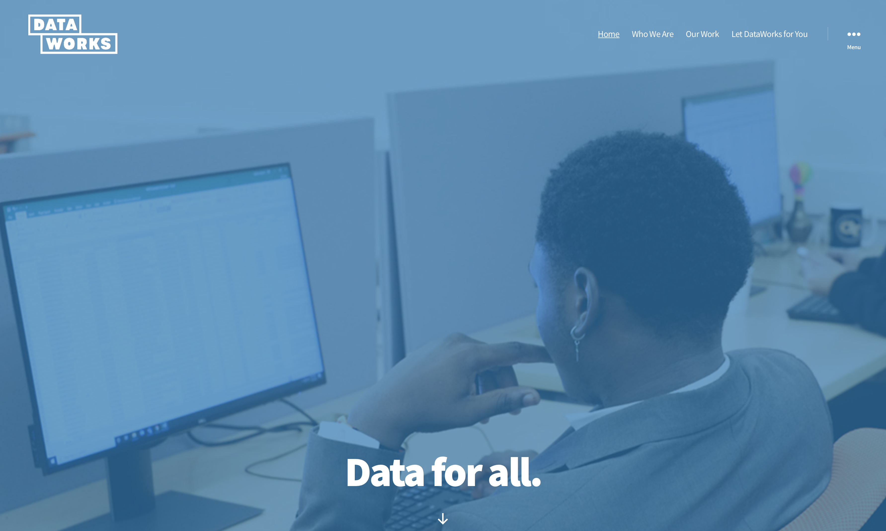

# Data-Vis-for-DataWorks
Hi! This is a repository of code examples and instructions for an introductory workshop about data visualization for DataWorks (see: https://dataworkforce.gatech.edu). This workshop also introduces participants to data visualization with the Processing Programming Language and Unfolding Maps Library.

TO USE CODE EXAMPLES/PARTICIPATE IN THIS WORKSHOP:
1) If you haven't already, please download the most recent version of Processing at: https://processing.org/download/
2) Place the folder titled "Unfolding" included in this repository within your processing "libraries" folder (located within the Processing folder on your computer). Unfolding is a wonderful mapping Library developed by Till Nagel & contributers (see credits below).

CREDITS:
Unfolding Maps Library is developed at the Interaction Design Lab, FH Potsdam, the HCI group, KU Leuven, and MIT Senseable City Labs. Copyright (C) 2015 Till Nagel, and contributors. See http://unfoldingmaps.org/contact.html

Image of Racial Dot Map: D. Cable. 2013. Weldon Cooper Center for Public Service, Rector and Visitors of the University of Virginia. Copyright, 2013.
Image of basketball court retrieved online, 7/20/2019 at: https://www.conceptdraw.com/How-To-Guide/basketball-court-dimensions
